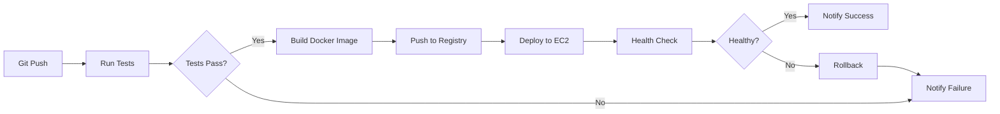

# CI/CD Pipeline Setup - Content Factory

## 🚀 Automated Deployment with GitHub Actions

Set up continuous integration and deployment for your Content Factory application.

---

## 🎯 What This Provides

- ✅ Automated testing on every push
- ✅ Automatic deployment to production
- ✅ Docker image building and versioning
- ✅ Health checks after deployment
- ✅ Rollback capabilities
- ✅ Slack/Email notifications
- ✅ Zero-downtime deployments

---

## 📋 Pipeline Overview



---

## 🔧 Step 1: Set Up GitHub Repository

**Initialize Git repository (if not already):**

```bash
cd c:\Users\HP\Desktop\Donnie\Content-Factory

# Initialize git
git init

# Add remote
git remote add origin https://github.com/your-username/content-factory.git

# Create .gitignore
cat > .gitignore << EOF
# Python
__pycache__/
*.py[cod]
*$py.class
*.so
.Python
venv/
ENV/

# Environment
.env
.env.local
.env.production

# IDE
.vscode/
.idea/
*.swp

# Logs
logs/
*.log

# Database
*.db
*.sqlite

# Docker
docker-compose.override.yml

# OAuth tokens
youtube_token.pickle
*.pickle

# OS
.DS_Store
Thumbs.db

# Testing
.pytest_cache/
.coverage
htmlcov/
EOF

# Initial commit
git add .
git commit -m "Initial commit"
git push -u origin main
```

---

## 🔐 Step 2: Configure GitHub Secrets

**Go to your GitHub repository:**
1. Settings → Secrets and variables → Actions
2. Click "New repository secret"

**Add these secrets:**

```
AWS_ACCESS_KEY_ID          - Your AWS access key
AWS_SECRET_ACCESS_KEY      - Your AWS secret key
EC2_HOST                   - ec2-13-36-168-66.eu-west-3.compute.amazonaws.com
EC2_SSH_KEY                - Your private SSH key (contents of .pem file)
SLACK_WEBHOOK              - (Optional) Slack webhook URL for notifications
SUPABASE_URL               - Your Supabase URL
SUPABASE_KEY               - Your Supabase key
OPENAI_API_KEY             - Your OpenAI API key
YOUTUBE_CLIENT_SECRET      - Your YouTube client secret
```

---

## 📝 Step 3: Create GitHub Actions Workflow

**The workflow file has been created at:**
`.github/workflows/deploy-production.yml`

**Workflow stages:**

1. **Test Stage**
   - Run pytest with coverage
   - Upload coverage reports
   - Fail deployment if tests fail

2. **Build Stage**
   - Build Docker image
   - Tag with commit SHA
   - Push to Docker Hub or AWS ECR

3. **Deploy Stage**
   - SSH to EC2 instance
   - Pull latest code
   - Update Docker containers
   - Run health checks

4. **Notify Stage**
   - Send Slack/Email notifications
   - Report success or failure

---

## 🐳 Step 4: Set Up Docker Registry

### Option A: Docker Hub (Simple)

**Login to Docker Hub:**

```bash
docker login
```

**Update workflow to use Docker Hub:**

```yaml
- name: Build and push to Docker Hub
  run: |
    docker build -f Dockerfile.prod -t yourusername/content-factory:${{ github.sha }} .
    docker build -f Dockerfile.prod -t yourusername/content-factory:latest .
    docker push yourusername/content-factory:${{ github.sha }}
    docker push yourusername/content-factory:latest
```

**Add Docker Hub credentials to GitHub secrets:**
- `DOCKER_USERNAME`
- `DOCKER_PASSWORD`

### Option B: AWS ECR (Recommended for AWS)

**Create ECR repository:**

```bash
aws ecr create-repository \
  --repository-name content-factory \
  --region eu-west-3
```

**Get ECR login:**

```bash
aws ecr get-login-password --region eu-west-3 | \
  docker login --username AWS --password-stdin \
  <account-id>.dkr.ecr.eu-west-3.amazonaws.com
```

---

## 🔑 Step 5: Configure EC2 for Automated Deployment

**SSH to EC2 and set up deployment user:**

```bash
ssh -i "your-key.pem" ubuntu@ec2-13-36-168-66.eu-west-3.compute.amazonaws.com

# Install GitHub CLI (optional but useful)
curl -fsSL https://cli.github.com/packages/githubcli-archive-keyring.gpg | \
  sudo dd of=/usr/share/keyrings/githubcli-archive-keyring.gpg
echo "deb [arch=$(dpkg --print-architecture) signed-by=/usr/share/keyrings/githubcli-archive-keyring.gpg] https://cli.github.com/packages stable main" | \
  sudo tee /etc/apt/sources.list.d/github-cli.list > /dev/null
sudo apt update
sudo apt install gh

# Configure git
git config --global user.name "Your Name"
git config --global user.email "your-email@example.com"

# Set up SSH key for GitHub
ssh-keygen -t ed25519 -C "ec2-deployment"
cat ~/.ssh/id_ed25519.pub
# Add this public key to GitHub: Settings → SSH keys
```

**Create deployment script on EC2:**

```bash
cat > /home/ubuntu/deploy.sh << 'EOF'
#!/bin/bash
set -e

echo "🚀 Starting deployment..."

cd /home/ubuntu/content-factory

# Pull latest code
echo "📥 Pulling latest code..."
git pull origin main

# Pull latest images
echo "🐳 Pulling Docker images..."
docker-compose -f docker-compose.prod.yml pull

# Update containers
echo "🔄 Updating containers..."
docker-compose -f docker-compose.prod.yml up -d --no-deps --build

# Wait for app to start
echo "⏳ Waiting for application to start..."
sleep 10

# Health check
echo "🏥 Running health check..."
if curl -f http://localhost:8000/health; then
  echo "✅ Deployment successful!"
  exit 0
else
  echo "❌ Health check failed! Rolling back..."
  docker-compose -f docker-compose.prod.yml rollback
  exit 1
fi
EOF

chmod +x /home/ubuntu/deploy.sh
```

---

## 🧪 Step 6: Test the Pipeline

**Make a small change and push:**

```bash
# Make a change
echo "# Test deployment" >> README.md

# Commit and push
git add README.md
git commit -m "Test CI/CD pipeline"
git push origin main
```

**Monitor the workflow:**
1. Go to GitHub repository
2. Click "Actions" tab
3. Watch the workflow execute

---

## 🔄 Step 7: Set Up Rollback Strategy

**Create rollback script on EC2:**

```bash
cat > /home/ubuntu/rollback.sh << 'EOF'
#!/bin/bash
set -e

echo "⏪ Rolling back to previous version..."

cd /home/ubuntu/content-factory

# Get previous commit
PREVIOUS_COMMIT=$(git rev-parse HEAD~1)

# Checkout previous commit
git checkout $PREVIOUS_COMMIT

# Restart containers with previous version
docker-compose -f docker-compose.prod.yml up -d --force-recreate

echo "✅ Rollback complete!"
EOF

chmod +x /home/ubuntu/rollback.sh
```

**Manual rollback:**

```bash
ssh -i "your-key.pem" ubuntu@ec2-13-36-168-66.eu-west-3.compute.amazonaws.com
/home/ubuntu/rollback.sh
```

---

## 📊 Step 8: Add Deployment Notifications

### Slack Notifications

**Create Slack webhook:**
1. Go to https://api.slack.com/apps
2. Create new app
3. Add "Incoming Webhooks"
4. Copy webhook URL
5. Add to GitHub secrets as `SLACK_WEBHOOK`

### Email Notifications (Alternative)

**Add to workflow:**

```yaml
- name: Send email notification
  uses: dawidd6/action-send-mail@v3
  with:
    server_address: smtp.gmail.com
    server_port: 465
    username: ${{ secrets.EMAIL_USERNAME }}
    password: ${{ secrets.EMAIL_PASSWORD }}
    subject: Deployment ${{ job.status }}
    body: Deployment to production completed with status ${{ job.status }}
    to: your-email@example.com
    from: GitHub Actions
```

---

## 🏥 Step 9: Add Health Checks and Monitoring

**Create comprehensive health check:**

Update `app/main.py`:

```python
@app.get("/health/detailed")
async def detailed_health_check():
    from app.core.database import SessionLocal
    from app.services.health_check import check_all_services_health
    import psutil
    
    db = SessionLocal()
    try:
        # Service health
        services_health = await check_all_services_health(db)
        
        # System metrics
        system_metrics = {
            "cpu_percent": psutil.cpu_percent(),
            "memory_percent": psutil.virtual_memory().percent,
            "disk_percent": psutil.disk_usage('/').percent
        }
        
        # Git info
        import subprocess
        git_commit = subprocess.check_output(['git', 'rev-parse', 'HEAD']).decode('ascii').strip()
        
        return {
            "status": "healthy",
            "timestamp": datetime.now().isoformat(),
            "version": git_commit[:7],
            "services": services_health,
            "system": system_metrics
        }
    finally:
        db.close()
```

---

## 🔒 Step 10: Security Best Practices

### Secrets Management

**Never commit secrets to Git:**
- Use `.env` files (gitignored)
- Use GitHub Secrets for CI/CD
- Use AWS Secrets Manager for production

**Rotate credentials regularly:**

```bash
# Generate new secret key
python -c "import secrets; print(secrets.token_urlsafe(32))"
```

### Scanning for Vulnerabilities

**Add security scanning to workflow:**

```yaml
- name: Run security scan
  uses: aquasecurity/trivy-action@master
  with:
    image-ref: 'your-image:latest'
    format: 'sarif'
    output: 'trivy-results.sarif'

- name: Upload scan results
  uses: github/codeql-action/upload-sarif@v2
  with:
    sarif_file: 'trivy-results.sarif'
```

---

## 📈 Step 11: Performance Monitoring

**Add deployment markers to CloudWatch:**

```python
def track_deployment():
    """Track deployment in CloudWatch"""
    from app.utils.cloudwatch_metrics import cloudwatch_metrics
    import subprocess
    
    git_commit = subprocess.check_output(
        ['git', 'rev-parse', 'HEAD']
    ).decode('ascii').strip()
    
    cloudwatch_metrics.put_metric(
        'Deployment',
        1,
        'Count',
        [{'Name': 'Commit', 'Value': git_commit[:7]}]
    )
```

---

## 🎯 Advanced Workflows

### Deploy to Staging First

**Create staging workflow:**

`.github/workflows/deploy-staging.yml`:

```yaml
name: Deploy to Staging

on:
  push:
    branches:
      - develop

jobs:
  deploy-staging:
    runs-on: ubuntu-latest
    steps:
      # Similar to production but deploy to staging environment
```

### Blue-Green Deployment

**Use multiple target groups:**

1. Deploy to "green" environment
2. Run tests
3. Switch traffic from "blue" to "green"
4. Keep "blue" as rollback option

### Canary Deployment

**Gradually roll out to subset of users:**

```bash
# Route 10% of traffic to new version
aws elbv2 modify-rule \
  --rule-arn <rule-arn> \
  --actions Type=forward,ForwardConfig='{
    "TargetGroups": [
      {"TargetGroupArn": "<old-tg>", "Weight": 90},
      {"TargetGroupArn": "<new-tg>", "Weight": 10}
    ]
  }'
```

---

## ✅ Verification Checklist

- [ ] GitHub repository created
- [ ] GitHub secrets configured
- [ ] Workflow file created
- [ ] Docker registry set up
- [ ] EC2 configured for deployment
- [ ] Deployment script tested
- [ ] Rollback strategy in place
- [ ] Notifications configured
- [ ] Health checks working
- [ ] First deployment successful

---

## 🚨 Troubleshooting

### Deployment fails at health check

**Check:**
```bash
ssh -i "your-key.pem" ubuntu@ec2-13-36-168-66.eu-west-3.compute.amazonaws.com
docker-compose -f docker-compose.prod.yml logs app
curl http://localhost:8000/health
```

### SSH connection fails

**Verify:**
- EC2 security group allows SSH
- Private key is correct
- Host is correct in GitHub secrets

### Docker image build fails

**Check:**
- Dockerfile syntax
- All dependencies in requirements.txt
- .dockerignore not excluding required files

---

## 📊 Monitoring Deployments

**View deployment history:**

```bash
# GitHub CLI
gh run list --workflow=deploy-production.yml

# View specific run
gh run view <run-id>

# View logs
gh run view <run-id> --log
```

**CloudWatch deployment tracking:**

```bash
aws cloudwatch get-metric-statistics \
  --namespace ContentFactory \
  --metric-name Deployment \
  --start-time 2025-10-01T00:00:00Z \
  --end-time 2025-10-21T00:00:00Z \
  --period 86400 \
  --statistics Sum
```

---

## 🎯 Summary

Your Content Factory now has:
- ✅ Fully automated CI/CD pipeline
- ✅ Automated testing before deployment
- ✅ Docker-based deployment
- ✅ Health check validation
- ✅ Rollback capabilities
- ✅ Deployment notifications
- ✅ Zero-downtime updates

**Deployment flow:**
```
Git Push → Tests → Build → Deploy → Health Check → Notify
```

**Next:** Monitor your deployments and iterate on your application!

---

## 📚 Additional Resources

- **GitHub Actions Docs:** https://docs.github.com/en/actions
- **Docker Best Practices:** https://docs.docker.com/develop/dev-best-practices/
- **AWS Deployment:** https://docs.aws.amazon.com/
- **Zero Downtime:** https://www.martin fowler.com/bliki/BlueGreenDeployment.html

Your Content Factory is now production-ready with enterprise-grade CI/CD! 🚀
